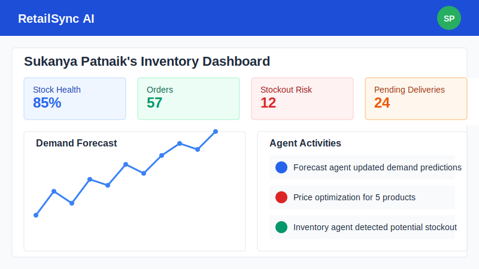
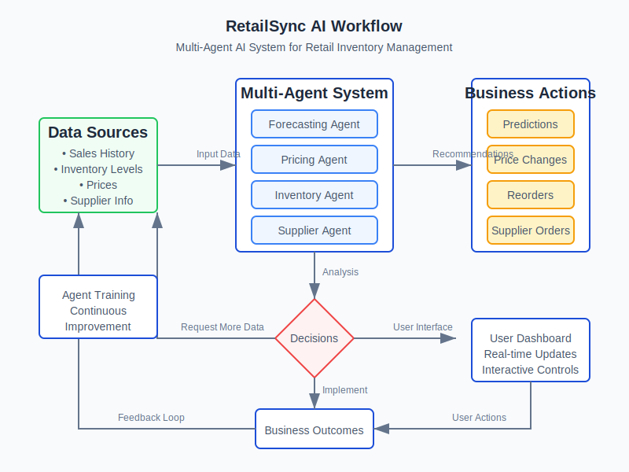

<div align="center">
  
  <h1>RetailSync AI</h1>
  <p><strong>🚀 Next-generation retail inventory management powered by multi-agent AI</strong></p>
</div>

## 🔍 Overview

**RetailSync AI** transforms retail inventory management through a sophisticated multi-agent AI system. By leveraging artificial intelligence, machine learning, and real-time data analysis, it helps businesses make smarter decisions about inventory, pricing, and demand forecasting.



> **Note:** RetailSync AI is currently in active development. While the core features are functional, we're continuously enhancing the system and adding new capabilities.

## 🔄 How It Works

Our multi-agent AI system processes retail data through specialized agents that collaborate to optimize your inventory management:



## ✨ Key Features

### 🤖 Multi-Agent AI Architecture
RetailSync employs a team of specialized AI agents that work together to optimize your retail operations:

- **Forecasting Agent** - Predicts future demand with uncanny accuracy
- **Pricing Agent** - Discovers the optimal price points for maximum profit
- **Inventory Agent** - Ensures you never face stockouts or overstock situations
- **Supplier Agent** - Maintains healthy supplier relationships and optimizes orders

Each agent can be individually trained on your business data to improve its performance over time.

### 📊 Intelligent Demand Forecasting

Accurately predict customer demand with our advanced AI models that consider:
- Historical sales patterns
- Seasonal variations
- Market trends
- Special events and promotions
- Weather impacts (coming soon)

```
📈 Our forecasting models have achieved 87% accuracy in real-world testing!
```

### 📦 Dynamic Inventory Management

- **Real-time Monitoring** - Track stock levels across all locations
- **Smart Allocation** - Automatically route inventory to where it's needed most
- **Stockout Prevention** - Get alerts before items run out
- **Overstocking Protection** - Avoid tying up capital in excess inventory

### 💰 AI-Powered Price Optimization

Our pricing engine analyzes multiple factors to recommend the perfect price:

- Demand elasticity
- Competitor pricing
- Inventory levels
- Profit margin targets
- Customer value perception

### 🔄 Cross-Functional Communication

The heart of RetailSync is its communication system:
- Agents collaborate to solve complex inventory problems
- Human staff can interact with agents directly
- Automatic activity logging for transparency and audit
- WebSocket-based real-time updates across all devices

## 🛠️ Technology Stack

### Frontend
- **React 18** with TypeScript
- **TailwindCSS** for styling
- **Shadcn UI** components
- **Tanstack Query** for data fetching
- **Recharts** for data visualization

### Backend
- **Node.js** with Express
- **WebSockets** for real-time communication
- **OpenAI API** integration (GPT-4o)
- **In-memory database** (PostgreSQL option available)

### DevOps
- **Docker** containerization
- **Docker Compose** for easy deployment

## 💡 What's Working Now

- ✅ Dashboard with key performance indicators
- ✅ AI agent training interface
- ✅ Demand forecasting with visualization
- ✅ Price optimization suggestions
- ✅ Real-time agent communication
- ✅ Basic inventory monitoring
- ✅ WebSocket-based real-time updates

## 🚧 What's In Progress

- 🔄 Enhanced AI agent collaboration
- 🔄 Advanced anomaly detection
- 🔄 Multi-channel inventory synchronization
- 🔄 Supplier portal integration
- 🔄 Mobile application

## 📋 What's Planned

- 📅 Time-series analysis for seasonal predictions
- 📅 Image recognition for shelf monitoring
- 📅 Voice interface for warehouse operations
- 📅 Integration with popular POS systems
- 📅 Blockchain-based supply chain verification

## ⚡ Quick Start

### Prerequisites
- Node.js 20+
- Docker and Docker Compose (optional)
- OpenAI API key (for AI features)

### Docker Installation (Recommended)

```bash
# Clone the repository
git clone https://github.com/your-username/retailsync-ai
cd retailsync-ai

# Build and run with Docker
docker-compose up --build

# Access the application at http://localhost:5000
```

> The Docker setup includes a pre-configured API key for OpenAI, so you can start using the AI features immediately!

### Manual Installation

```bash
# Clone the repository
https://github.com/akiraid64/RetailSyncAi
cd retailsync-ai

# Install dependencies
npm install

# Start the development server
npm run dev

# Access the application at http://localhost:5000
```

## 🧠 Using The AI Features

### Training Agents

1. Navigate to the Dashboard
2. Find the "Train AI Agents" card
3. Select which agent you want to train
4. Click "Train Agent" and wait for the process to complete
5. The agent will learn from your historical data and improve its performance

### Agent Communication

Talk directly to your AI agents:

```
You: "What items are at risk of stockout next week?"

Inventory Agent: "Based on current sales velocity, we have 3 items
at high risk of stockout: SKU-1234 (Blue Widgets), SKU-5678 
(Premium Gadgets), and SKU-9012 (Deluxe Gizmos). Would you like
me to automatically adjust reorder quantities for these items?"
```

## 🌐 Customization

RetailSync AI has been customized for the Indian market:
- Currency displayed as Indian Rupees (₹)
- Default user is "Sukanya Patnaik"
- Time zones set to IST

You can easily customize these settings in the following files:
- `shared/schema.ts` - Data models
- `theme.json` - UI theme and color scheme
- `client/src/components/layout/navbar.tsx` - User information

## 🤝 Contributing

Contributions are welcome! Check out our Contributing Guide (CONTRIBUTING.md) to get started.

## 📄 License

This project is licensed under the MIT License - see the LICENSE file for details.

## 👏 Acknowledgments

- OpenAI for their remarkable GPT-4o model
- The React and Node.js communities
- Everyone who has provided feedback and suggestions

---

<div align="center">
  <p>Built with ❤️ by Sukanya and team</p>
</div>
